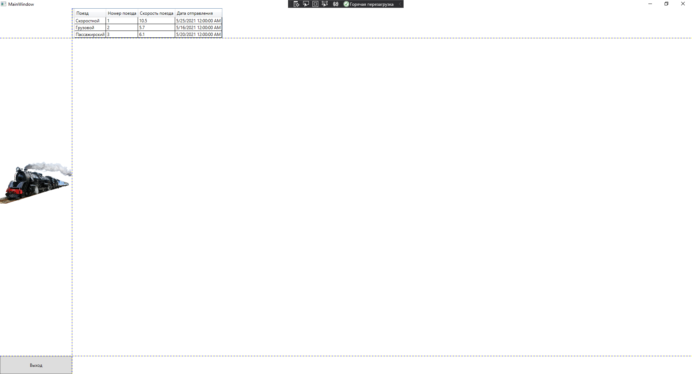

<table style="width: 100%;">
  <tr>
    <td style="text-align: center; border: none;">
    Министерство образования и науки РФ<br>
Государственное бюджетное профессиональное образовательное учреждение Республики Марий Эл<br>
Йошкар-Олинский технологический колледж
</td>
  </tr>
  <tr>
    <td style="text-align: center; border: none; height: 15em;">
    <h2 style="font-size:3em;">Отчет</h2>
      <h3>Поезда </h3></td>
  </tr>
  <tr>
    <br><br><td style="text-align: right; border: none; height: 20em;">
      Разработал:<br/>
      Малинин Никита<br>
      Группа: И-21<br>
      Преподаватель:<br>
      Колесников Евгений Иванович
    </td>
  </tr>
  <tr>
    <td style="text-align: center; border: none; height: 5em;">
    г.Йошкар-Ола, 2021</td>
  </tr>
</table>

<div style="page-break-after: always;"></div>

# Цели и задачи:
 1. Создать Модель данных
 2. Создать Каркас приложения.
 3. Привязка данных. Табличный вывод


# Краткий материал.


Сначала создадим класс для элемента справочника

```
public class Train
    {
        public string Type { get; set; }
        public int Number { get; set; }
        public float Speed { get; set; }
        public DateTime TimeFrom { get; set; }
    }
```


В интерфейс поставщика данных (IDataProvider) добавляем метод для получения списка категорий

```
interface IDataProvider
    {
        IEnumerable<Train> GetTrains();
    }
```
2.Заполняем LocalDataProvider для выведения информации в приложении:
{
    public class LocalDataProvider : IDataProvider
    {
        public IEnumerable<Train> GetTrains()
        {
            return new Train[]{ 
                new Train{Type="Скоростной", Number=1, Speed=10.5F, TimeFrom=new DateTime(2021,05,25) },
            new Train{Type="Грузовой", Number=2, Speed=5.7F,TimeFrom=new DateTime(2021,05,16)},
            new Train{Type="Пассажирский",Number=3,Speed=6.1F,TimeFrom=new DateTime(2021,05,20)} };
        }                 
    }
}

3. Чтобы задать позицию элемента управления с привязкой к определенной ячейке Grid-а, в разметке элемента нужно прописать значения свойств Grid.Column и Grid.Row, тем самым указывая, в каком столбце и строке будет находиться элемент. Кроме того, если мы хотим растянуть элемент управления на несколько строк или столбцов, то можно указать свойства Grid.ColumnSpan и Grid.RowSpan, как в следующем примере:

    ```


```xml
 <Window x:Class="WpfApp40.MainWindow"
        xmlns="http://schemas.microsoft.com/winfx/2006/xaml/presentation"
        xmlns:x="http://schemas.microsoft.com/winfx/2006/xaml"
        xmlns:d="http://schemas.microsoft.com/expression/blend/2008"
        xmlns:mc="http://schemas.openxmlformats.org/markup-compatibility/2006"
        xmlns:local="clr-namespace:WpfApp40"
        mc:Ignorable="d"
        Title="MainWindow" Height="450" Width="800">
    <Grid >
        <Grid.RowDefinitions>
            <RowDefinition Height="auto"/>
            <RowDefinition/>
            <RowDefinition Height="50"/>
        </Grid.RowDefinitions>
        <Grid.ColumnDefinitions>
            <ColumnDefinition Width="200"/>
            <ColumnDefinition/>
        </Grid.ColumnDefinitions>
```
4.Теперь, имея данные для отображения, мы можем разместить в разметке элемент DataGrid и "привязать" к нему данные:

```xml
        <!--Приложение-->
          <DataGrid
        Grid.Row="1"
        Grid.Column="1"
        CanUserAddRows="False"
        AutoGenerateColumns="False"
        ItemsSource="{Binding TrainList}" SelectionChanged="DataGrid_SelectionChanged">
                <DataGrid.Columns>
                    <DataGridTextColumn
             Header="Поезд"
                Binding="{Binding Type }"/>
                    <DataGridTextColumn
             Header="Номер поезда"
                Binding="{Binding Number}"/>
                    <DataGridTextColumn
             Header="Скорость поезда"
                Binding="{Binding Speed}"/>
                    <DataGridTextColumn
             Header="Дата отправления"
                Binding="{Binding TimeFrom }"/>

                </DataGrid.Columns>

           
        </DataGrid>
        </WrapPanel>
    </Grid>
</Window>

```


